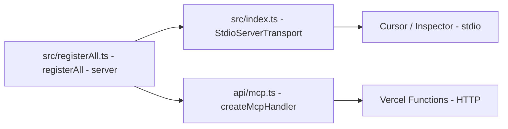

# TypeScript MCP Server (stdio + Vercel HTTP)

TypeScript MCP SDK를 활용한 Model Context Protocol 서버 보일러플레이트입니다.
**로컬 stdio**와 **Vercel HTTP** 두 가지 방식으로 동일한 도구를 제공합니다.

## 프로젝트 구조

```
typescript-mcp-server-boilerplate/
├── src/
│   ├── registerAll.ts    # 모든 tool/resource/prompt 등록 로직 (공유)
│   └── index.ts          # 로컬 stdio 진입점
├── api/
│   └── mcp.ts            # Vercel Functions HTTP 엔드포인트
├── build/                # tsc 컴파일 결과 (stdio용, 빌드 후 생성)
├── package.json
├── tsconfig.json
├── vercel.json           # Vercel 배포 설정
├── .env.local.example    # 환경변수 예시
└── README.md
```



## 제공되는 기능

| 종류 | 이름 | 설명 |
|------|------|------|
| Tool | `greet` | 이름과 언어를 입력하면 인사말 반환 |
| Tool | `calculate` | 사칙연산(+, -, *, /) 결과 반환 |
| Tool | `get_coordinates` | 도시명 -> 위도/경도 (Nominatim, 무료) |
| Tool | `get_weather` | 좌표 + 선택적 날짜로 날씨 조회 (Open-Meteo, 무료) |
| Tool | `generate-image` | HuggingFace FLUX.1-schnell 이미지 생성 (HF_TOKEN 필요) |
| Resource | `mcp://my-mcp-server/info` | 서버 메타 정보 |
| Prompt | `code-review` | 코드 리뷰 프롬프트 템플릿 |

## 1. 의존성 설치

```bash
npm install
```

## 2. 로컬 stdio 모드 (개발/디버깅용)

### 빌드 및 실행

```bash
npm run build
npm run start:stdio
```

### Cursor 등록

`.cursor/mcp.json`:

```json
{
    "mcpServers": {
        "my-mcp-server": {
            "command": "node",
            "args": ["/ABSOLUTE/PATH/TO/PROJECT/build/index.js"],
            "env": {
                "HF_TOKEN": "hf_..."
            }
        }
    }
}
```

> 경로는 OS에 맞는 절대 경로로 변경하세요.

### MCP Inspector로 디버깅

```bash
npx @modelcontextprotocol/inspector node build/index.js
```

## 3. Vercel 배포 모드 (HTTP)

### 환경변수 준비

`.env.local.example`을 `.env.local`로 복사하고 `HF_TOKEN`을 입력합니다.

```bash
cp .env.local.example .env.local
```

### 로컬 HTTP 개발 서버

```bash
npm run dev   # vercel dev 실행 (vercel CLI 필요)
```

`http://localhost:3000/api/mcp`로 MCP 클라이언트가 연결합니다.

### Vercel 배포

```bash
vercel deploy
# 또는 production
vercel deploy --prod
```

배포 후 Vercel 대시보드 또는 CLI로 환경변수 등록:

```bash
vercel env add HF_TOKEN
```

### Cursor에서 원격 HTTP 사용

`.cursor/mcp.json`:

```json
{
    "mcpServers": {
        "my-mcp-server": {
            "url": "https://<your-project>.vercel.app/api/mcp"
        }
    }
}
```

stdio만 지원하는 클라이언트는 [`mcp-remote`](https://www.npmjs.com/package/mcp-remote)로 브리지:

```json
{
    "mcpServers": {
        "my-mcp-server": {
            "command": "npx",
            "args": ["-y", "mcp-remote", "https://<your-project>.vercel.app/api/mcp"]
        }
    }
}
```

## 새 도구 추가 방법

`src/registerAll.ts`에 한 번 등록하면 stdio와 Vercel HTTP 양쪽에서 자동으로 사용 가능합니다.

```typescript
server.registerTool(
    'my-tool',
    {
        description: '도구 설명',
        inputSchema: z.object({
            input: z.string()
        })
    },
    async ({ input }) => {
        return {
            content: [{ type: 'text', text: `결과: ${input}` }]
        }
    }
)
```

## 주요 의존성

- **@modelcontextprotocol/sdk** — MCP TypeScript SDK
- **mcp-handler** — Vercel용 MCP HTTP 어댑터 (StreamableHTTPServerTransport stateless)
- **@huggingface/inference** — HuggingFace Inference API 클라이언트
- **zod** — 스키마 검증

## 제약 사항

- **Vercel Functions stateless**: 요청 간 메모리 상태가 유지되지 않습니다. 도구 핸들러는 외부 API/DB에 의존해야 합니다.
- **maxDuration 60초** (Hobby 한도): `generate-image` 같은 장시간 도구는 타임아웃 가능. Pro/Enterprise는 더 늘릴 수 있습니다.
- **세션 모드 사용 시 Redis 필요**: 현재는 stateless 모드라 불필요.

## 참고 자료

- [Model Context Protocol 공식](https://modelcontextprotocol.io/)
- [MCP TypeScript SDK](https://github.com/modelcontextprotocol/typescript-sdk)
- [mcp-handler (Vercel)](https://www.npmjs.com/package/mcp-handler)
- [Vercel MCP 가이드](https://vercel.com/docs/mcp)

## 라이선스

MIT
